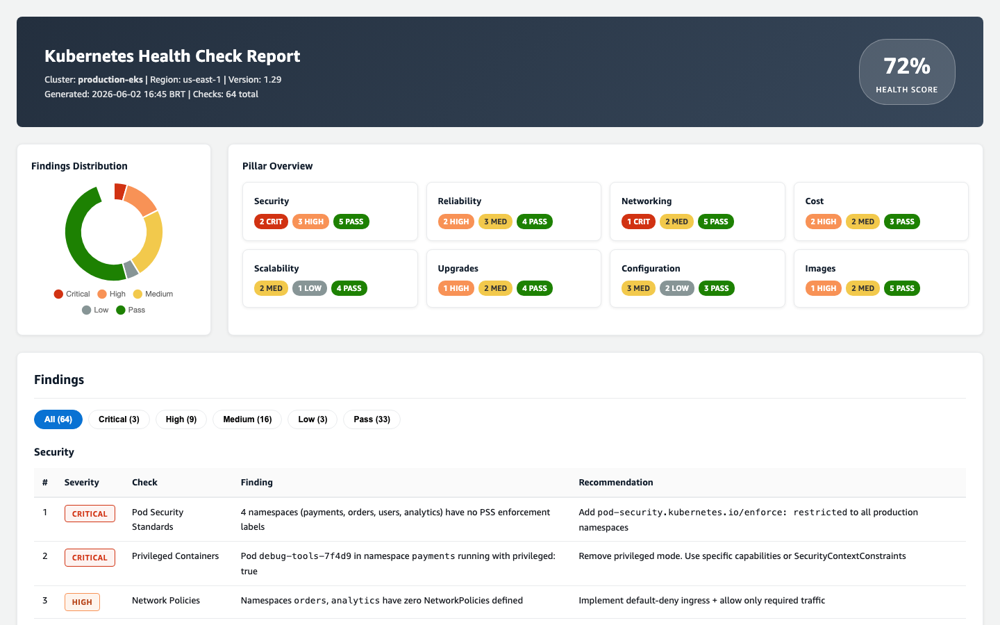
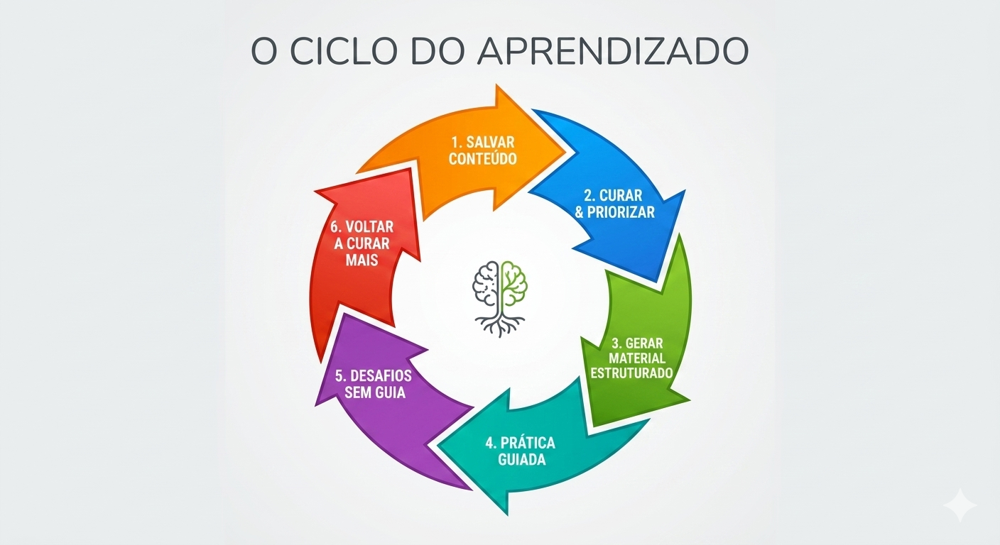
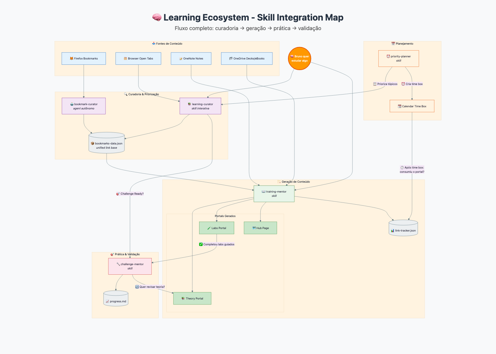

# Kiro - Skills, Powers & Steering

Uma coleção de customizações para o [Kiro](https://kiro.dev) - a IDE com assistente de IA integrado. Este repositório contém Skills (capacidades especializadas), Powers (integrações MCP) e templates de Steering (personalização do assistente) prontos para uso.

## Sumário

- [💡 O que é o Kiro?](#o-que-é-o-kiro)
- [🎯 Steering - Personalizando seu Assistente](#steering---personalizando-seu-assistente)
- [🧩 Skills - Capacidades Especializadas](#skills---capacidades-especializadas)
- [⚡ Powers - Integrações MCP](#powers---integrações-mcp)
- [🔄 AWS Transform - Custom Definitions](#-aws-transform---custom-definitions)
- [📂 Estrutura do Repositório](#estrutura-do-repositório)
- [🧠 Learning Ecosystem Skills](#-learning-ecosystem-skills)
- [🤖 Agents](#-agents)
- [🛠️ Como Criar sua Própria Skill](#como-criar-sua-própria-skill)
- [🤝 Contribuindo](#contribuindo)
- [📄 Licença](#licença)

## O que é o Kiro?

[Kiro](https://kiro.dev) é uma IDE com assistente de IA que vai muito além de escrever código. Com Skills, Powers e Steering, o Kiro se transforma em um assistente pessoal completo - capaz de preparar você pra certificações, revisar gramática em outros idiomas, curar bookmarks, gerar documentação técnica, gerenciar pipelines de vendas e muito mais. Desenvolvedores são o público principal, mas as possibilidades de automação e produtividade se estendem a qualquer profissional.

Para conhecer todas as formas de personalização e extensão, veja a [documentação oficial](https://kiro.dev/docs/). Neste repositório, focamos em três delas:

> 💡 Quer ir além da IDE? O [Kiro Assistant](https://github.com/aws-samples/sample-kiro-assistant) é um app desktop Electron que usa o `kiro-cli` como motor de agente para tarefas do dia a dia - criar áudio, vídeo, apresentações, modelagem em Excel, pesquisa profunda e mais. Com 500+ tools via Composio e skills carregadas dinamicamente, ele mostra que o Kiro pode ser útil pra qualquer pessoa, não só desenvolvedores.

- [**Steering**](#steering--personalizando-seu-assistente) - documentos markdown que personalizam o comportamento do assistente
- [**Skills**](#skills--capacidades-especializadas) - instruções especializadas que dão ao agente capacidades específicas
- [**Powers**](#powers--integrações-mcp) - integrações com serviços externos via Model Context Protocol (MCP)

> 📥 [Download do Kiro](https://kiro.dev/downloads/)

> 📂 **Pasta de configuração do Kiro:** os arquivos de personalização ficam na pasta `.kiro/` dentro do seu diretório home. No macOS/Linux é `~/.kiro/`, no Windows é `%USERPROFILE%\.kiro\`. Neste README, usamos `<KIRO_HOME>` para representar esse caminho.

### Pricing

O Kiro tem um **nível gratuito** usando o [AWS Builder ID](https://profile.aws.amazon.com/) - sem cartão de crédito, sem compromisso. Nos **primeiros 30 dias**, você ainda ganha **500 créditos de bônus** pra testar tudo.

**O que é 1 crédito?** Pense em créditos como tokens com peso variável. Prompts simples gastam menos de 1 crédito; tarefas complexas (como executar uma spec task) gastam mais. Modelos mais caros consomem mais créditos por prompt - por exemplo, Sonnet 4 custa ~1.3x mais que o modo Auto para a mesma tarefa. O menor consumo possível é 0.01 créditos.

Para detalhes completos, veja a [página de pricing do Kiro](https://kiro.dev/pricing/).

---

## Steering - Personalizando seu Assistente

Steering files são documentos markdown em `.kiro/steering/` que configuram como o assistente se comporta. Pense neles como **prompts permanentes** - em vez de repetir instruções a cada conversa, você documenta uma vez e o agente segue sempre.

### Tipos de inclusão

| Tipo | Quando carrega | Uso |
|------|---------------|-----|
| `always` | Toda interação | Regras gerais, estilo de comunicação, protocolos |
| `auto` | Quando o Kiro detecta relevância pelo conteúdo da conversa | Contexto útil mas não obrigatório (ADRs, convenções de domínio) |
| `manual` | Quando você chama `#nome` no chat | Contexto sob demanda (memória, referências) |
| `fileMatch` | Quando um arquivo específico é aberto | Regras por tipo de arquivo |

### Templates incluídos

Este repo inclui dois templates para você começar:

**[r2d2-template.md](steering/r2d2-template.md)** - Template do steering principal (`always`)

> 🤖 Por que "R2D2"? Dar um nome ao steering torna o conceito tangível: é o *seu* assistente. Alfred, Jarvis, Minions... aqui é R2D2 - o droid de Star Wars que combina processamento, inteligência, conhecimento e personalidade. Resolve problemas complexos, antecipa necessidades e nunca precisa de muita explicação. Escolha o que fizer sentido pra você.
- Seção "Sobre Você" - perfil, cargo, domínios
- Estilo de comunicação - tabela do que fazer vs. evitar
- Estrutura de respostas - padrão conclusão → detalhes → trade-offs → ação
- Modo de operação - protocolos de segurança, fluxo git, ambiente
- Critérios de qualidade - o que é uma resposta excelente vs. anti-padrões

**[memory-template.md](steering/memory-template.md)** - Template de memória acumulativa (`manual`)
- Correções e ajustes - erros corrigidos que não devem se repetir
- Preferências observadas - padrões do seu estilo de trabalho
- Padrões reutilizáveis - abordagens que funcionaram bem
- Decisões e justificativas - registro de decisões com raciocínio

### Como instalar

1. Copie os templates `steering/r2d2-template.md` e `steering/memory-template.md` para `<KIRO_HOME>/steering/`
2. Renomeie e edite com suas informações
3. O steering principal (`always`) carrega em toda interação
4. O memory (`manual`) você ativa com `#memory` no chat

> 💡 Pode fazer isso direto pelo Kiro: cole no chat algo como *"copie o template r2d2-template.md para a pasta de steering do Kiro e renomeie para meu-steering.md"* - o agente cuida do resto, independente do seu OS.

---

## Skills - Capacidades Especializadas

Skills são pacotes de instruções em markdown que dão ao agente do Kiro capacidades específicas. Uma skill pode ensinar o agente a seguir padrões de frontend, gerar documentação, preparar você pra uma certificação, ou qualquer outra tarefa que você repete com frequência. Seguem a especificação aberta [Agent Skills](https://agentskills.io/home).

Alguns exemplos do que skills podem fazer:

- [**frontend-design**](https://github.com/anthropics/skills/blob/main/skills/frontend-design/SKILL.md) (Anthropic) - define padrões de UI/UX, componentes e design system pro agente seguir ao gerar código frontend
- [**pptx**](https://github.com/anthropics/skills/blob/main/skills/pptx/SKILL.md) (Anthropic) - cria e edita apresentações PowerPoint programaticamente
- [**spanish-mentor**](skills/spanish-mentor/) (este repo) - mentor de gramática espanhola baseado nas regras da Real Academia Española (RAE)
- [**bookmark-curator**](skills/bookmark-curator/) (este repo) - transforma exports de bookmarks do Firefox em feeds visuais categorizados

Explore mais exemplos no [repositório de skills da Anthropic](https://github.com/anthropics/skills/tree/main/skills).

### Estrutura de uma Skill

```
skill-name/
├── SKILL.md              # Obrigatório - instruções principais + frontmatter
├── references/            # Opcional - docs detalhados carregados sob demanda
├── scripts/               # Opcional - scripts executáveis
└── assets/                # Opcional - templates, dados
```

O `SKILL.md` contém um frontmatter YAML (`name`, `description`) e o corpo com instruções. Arquivos em `references/` só são carregados quando necessário - isso é chamado de **progressive disclosure** e mantém o contexto leve.

### Skills neste repositório

| Skill | Descrição | Ative com |
|-------|-----------|-----------|
| [english-mentor](skills/english-mentor/) | Tutor de inglês americano baseado em padrões IELTS/TOEIC. Revisa gramática, sugere correções. | `#english-mentor` ou "review english" |
| [spanish-mentor](skills/spanish-mentor/) | Mentor de gramática espanhola baseado nas regras da Real Academia Española (RAE). | `#spanish-mentor` ou "corregir español" |
| [kubestronaut-coach](skills/kubestronaut-coach/) | Coach para certificações Kubernetes (CKA, CKAD, CKS, KCNA, KCSA). Foco em velocidade e atalhos para provas. | `#kubestronaut-coach` ou "desafio CKA" |
| [challenge-mentor](skills/challenge-mentor/) | Mentor técnico para desafios hands-on de Kubernetes/EKS. Gera cenários progressivos de troubleshooting com hints graduais. | `#challenge-mentor` ou "desafio k8s" |
| [training-mentor](skills/training-mentor/) | Gera portais HTML de estudo a partir de uma lista de tópicos. Inclui referências oficiais e vídeos. | `#training-mentor` ou "training content" |
| [learning-curator](skills/learning-curator/) | Gerenciador de fila de estudo pessoal. Captura links/artigos/repos, prioriza por entregas e gera dashboards. | `#learning-curator` ou "learning queue" |
| [bookmark-curator](skills/bookmark-curator/) | Processa exports de bookmarks do Firefox, categoriza, resume e gera um feed visual HTML. | `#bookmark-curator` ou "organizar bookmarks" |
| [tech-docs](skills/tech-docs/) | Gera documentação técnica estruturada a partir de código de infraestrutura (Terraform, K8s, ArgoCD). | `#tech-docs` ou "documentar projeto" |
| [skill-factory](skills/skill-factory/) | Guia a criação de novas skills seguindo a especificação Agent Skills. | `#skill-factory` ou "criar skill" |
| [ack-resource-adoption](skills/ack-resource-adoption/) | Adota recursos AWS existentes no ACK via Feature Gate `ResourceAdoption` e política `adopt-or-create`. Cobre discovery, manifests, deletion policy e validação. | `#ack-resource-adoption` ou "ACK adoption" |
| [daily-planner](skills/daily-planner/) | Assistente de planejamento diário e semanal com matriz Eisenhower, time boxing, detecção de conflitos e triage de tarefas. Funciona com qualquer calendar + task manager via MCP. | `#daily-planner` ou "plan my day" |

### Como instalar

1. Copie a pasta da skill desejada (ex: `skills/kubestronaut-coach/`) para `<KIRO_HOME>/skills/`
2. Para instalar todas, copie todo o conteúdo de `skills/` para `<KIRO_HOME>/skills/`

> 💡 Pode fazer isso direto pelo Kiro: cole no chat *"instalar a skill kubestronaut-coach"* ou *"instalar todas as skills deste repo"* - o agente copia os arquivos pra você.

Skills são ativadas no chat do Kiro usando `#nome-da-skill` ou mencionando as keywords definidas na `description` do frontmatter.

### Referências

- [Agent Skills Spec](https://agentskills.io/home) - especificação aberta para skills de agentes IA
- [Anthropic Skills Examples](https://github.com/anthropics/skills/tree/main/skills) - exemplos oficiais da Anthropic

---

## Powers - Integrações MCP

Powers dão ao agente acesso a conhecimento especializado com **carregamento dinâmico** - diferente de conectar MCP servers diretamente (onde 5 servers = 180+ tools = 40%+ da janela de contexto consumida antes do primeiro prompt), Powers ativam só quando o contexto da conversa pede e desativam quando não são mais relevantes.

Um Power é mais do que um MCP server - é um pacote que une **POWER.md** (steering pro agente), **configuração MCP** (tools e conexão) e opcionalmente **steering/hooks** (workflows automatizados). Para saber mais, veja a [documentação de Powers](https://kiro.dev/docs/powers/).

> 💡 Por que converti meus MCP servers em Powers? Economia de contexto. Empacotando como Power, o Kiro só carrega as tools quando precisa - respostas mais rápidas e com mais qualidade.

### Estrutura de um Power

```
power-name/
├── POWER.md              # Instruções e documentação
├── mcp.json              # Configuração do servidor MCP
└── steering/             # Opcional - guias de workflow
```

### Powers neste repositório

| Power | Descrição | MCP Server |
|-------|-----------|------------|
| [github-power](powers/github-power/) | Integração completa com GitHub - repos, issues, PRs, code search | `@modelcontextprotocol/server-github` |
| [eks-power](powers/eks-power/) | Gerenciamento de clusters AWS EKS - clusters, node groups, add-ons, pod identity | `awslabs.eks-mcp-server` |
| [kubernetes-power](powers/kubernetes-power/) | Operações Kubernetes - kubectl, Helm, pods, troubleshooting | `kubernetes MCP` |
| [k8s-healthcheck](powers/k8s-healthcheck/) | Health check e validação de boas práticas para clusters K8s/EKS. 8 pilares, 64 checks cobrindo security, reliability, networking, cost, scalability, upgrades, configuration e container image build. | `kubernetes` + `awslabs.eks-mcp-server` |
| [power-markitdown](powers/power-markitdown/) | Converte arquivos e URLs para Markdown (PDF, DOCX, PPTX, imagens, áudio) | `markitdown-mcp` |
| [power-aws-diagram](powers/power-aws-diagram/) | Gera diagramas de arquitetura AWS usando Python diagrams DSL | `awslabs/diagram-mcp-server` |
| [power-research-assistant](powers/power-research-assistant/) | Pesquisa profunda com loops iterativos plan-search-evaluate, verificação de fontes e prevenção de alucinações | `tavily` + `fetch` + `context7` + `deepwiki` |
| [power-ticktick](powers/power-ticktick/) | Gerenciamento de tarefas via TickTick MCP - Eisenhower Matrix, CRUD de tasks, reminders, gotchas do campo content | ticktick MCP |

### Como instalar

1. Copie a pasta do Power desejado (ex: `powers/k8s-healthcheck/`) para `<KIRO_HOME>/powers/installed/`
2. Reinicie o Kiro para reconectar os MCP servers
3. Se o Power exigir configuração (veja tabela de pré-requisitos abaixo), edite o `mcp.json` com suas credenciais

A maioria dos Powers funciona plug-and-play sem nenhuma configuração adicional. Apenas alguns exigem chaves ou credenciais específicas (como o github-power que precisa de um Personal Access Token).

> 💡 Pode fazer isso direto pelo Kiro: cole no chat *"instalar o power k8s-healthcheck"* - o agente copia os arquivos pra você.

> 💡 Explore mais Powers no [Kiro Powers Hub](https://kiro.dev/powers/)

### Pré-requisitos comuns

| Power | Requer |
|-------|--------|
| github-power | GitHub Personal Access Token |
| eks-power | AWS credentials configuradas (`aws configure`) |
| kubernetes-power | `kubeconfig` configurado |
| k8s-healthcheck | `kubeconfig` configurado + AWS credentials (para checks EKS) |
| power-markitdown | Python + `uvx` instalado |
| power-aws-diagram | Python + `uvx` instalado |
| power-research-assistant | Tavily API key (gratuita em [tavily.com](https://tavily.com)) |
| power-ticktick | Conta TickTick (OAuth via browser no primeiro uso) |

### Exemplo de Report: k8s-healthcheck

<p align="center">
  
</p>

> O Power **k8s-healthcheck** gera um report HTML interativo com health score, donut chart de findings, pillar cards clicáveis, tabelas filtradas por severidade e prioritized actions.

---

## 🔄 AWS Transform - Custom Definitions

[AWS Transform](https://aws.amazon.com/transform/) usa AI agents para analisar e transformar código automaticamente. Custom Transformation Definitions (TDs) permitem criar transformations específicas para casos de uso que o catálogo padrão não cobre.

### Custom TDs neste repositório

| TD | Descrição | Uso |
|----|-----------|-----|
| [eks-version-upgrade-readiness](transforms/atx-td-eks-upgrade/) | Analisa e transforma manifests K8s, Helm charts, Terraform e CDK para compatibilidade com uma versão target do EKS. Detecta APIs deprecadas, atualiza campos, valida addons e gera migration report. | `atx custom def exec -n eks-version-upgrade-readiness` |

### Relação com o k8s-healthcheck Power

- **k8s-healthcheck Power** = analisa o cluster RODANDO (runtime health, 64 checks em 8 pilares)
- **ATX TD eks-upgrade** = transforma o CÓDIGO antes do upgrade (code readiness, API migrations)

Juntos, oferecem upgrade end-to-end: código preparado + cluster validado.

### Como usar

```bash
# Transformar repo para compatibilidade com EKS 1.32
atx custom def exec \
  -n eks-version-upgrade-readiness \
  -p /path/to/customer-repo \
  -x -t \
  --configuration 'additionalPlanContext=Target EKS version 1.32. Upgrade from 1.28.'

# Apenas análise (sem modificar arquivos)
atx custom def exec \
  -n eks-version-upgrade-readiness \
  -p /path/to/customer-repo \
  -x -t \
  --configuration 'additionalPlanContext=Target EKS version 1.32. Analysis only - do not modify files.'
```

## Estrutura do Repositório

```
KIRO/
├── README.md
├── agents/
│   └── bookmark-curator/            # Agent autônomo para curadoria de bookmarks
├── steering/
│   ├── r2d2-template.md          # Template do steering principal
│   └── memory-template.md        # Template de memória acumulativa
├── skills/
│   ├── english-mentor/           # Tutor de inglês
│   ├── spanish-mentor/           # Mentor de espanhol
│   ├── kubestronaut-coach/       # Coach de certificações K8s
│   ├── challenge-mentor/           # Desafios hands-on K8s com hints progressivos
│   ├── training-mentor/          # Portais de estudo HTML (3 templates aprovados)
│   ├── learning-curator/          # Fila de estudo pessoal com priorização
│   ├── bookmark-curator/         # Curadoria de bookmarks
│   ├── tech-docs/                # Gerador de documentação técnica
│   ├── skill-factory/            # Meta-skill para criar novas skills
│   ├── ack-resource-adoption/    # Adoção de recursos AWS existentes no ACK
│   └── daily-planner/            # Planejamento diário/semanal com Eisenhower + time boxing
└── powers/
    ├── github-power/             # GitHub integration
    ├── eks-power/                # AWS EKS management
    ├── kubernetes-power/         # Kubernetes operations
    ├── k8s-healthcheck/          # K8s/EKS health check & best practices (8 pillars, 64 checks)
    ├── power-markitdown/         # File-to-Markdown converter
    ├── power-aws-diagram/        # AWS architecture diagrams
    ├── power-research-assistant/ # Deep research with source verification
    └── power-ticktick/           # TickTick task management (Eisenhower Matrix)
├── transforms/
│   └── atx-td-eks-upgrade/       # ATX Custom TD: EKS version upgrade code migration
├── examples/
│   ├── nginx-migration/          # Portal de migração NGINX Ingress → AWS LBC
│   ├── istio/                    # Portal de Istio Service Mesh no EKS
│   └── learning-ecosystem.html   # Diagrama interativo do ecossistema de skills
└── docs/
    └── learning-ecosystem.png    # Diagrama estático do ecossistema
```

---

## 🧠 Learning Ecosystem Skills

Um conjunto conectado de 3 Kiro skills + 1 agent que criam um pipeline completo de aprendizado autodirigido:

**bookmark-curator** (skill + agent) → **learning-curator** (skill) → **training-mentor** (skill) → **challenge-mentor** (skill)

### O problema

Aprendizado técnico é naturalmente disperso: bookmarks acumulam no browser, abas abertas viram dezenas sem critério, material de estudo não tem estrutura, e não existe forma de validar se você realmente aprendeu algo. Cada ferramenta resolve um pedaço - mas nenhuma conecta o ciclo completo de **capturar → priorizar → estudar → praticar → validar**.

O Learning Ecosystem resolve isso com 3 skills e 1 agent que funcionam como um pipeline integrado. Cada componente alimenta o próximo, criando um ciclo contínuo de aprendizado autodirigido.

### O ciclo de aprendizado

<p align="center">
  
</p>



> 📊 Veja também o [diagrama interativo](examples/learning-ecosystem.html) com o fluxo completo entre as skills.

### Os componentes do ciclo

**1. [bookmark-curator](skills/bookmark-curator/) - Ponto de entrada (skill + [agent](agents/bookmark-curator/))**

Processa exports de bookmarks do browser (Firefox JSON) e transforma um dump caótico de favoritos em dados estruturados e categorizados. Gera um feed visual HTML e alimenta o `bookmarks-data.json` - a base de links compartilhada que as outras skills consomem. Funciona como skill interativa no chat ou como [agent autônomo](agents/bookmark-curator/AUTOMATION.md) rodando em schedule (launchd, cron, Task Scheduler).

**2. [learning-curator](skills/learning-curator/) - Triagem e priorização**

Captura links de abas abertas do browser, cruza com entregas de trabalho próximas (via calendar) e prioriza o que estudar primeiro. Gera um dashboard de estudo com priorização estilo Eisenhower - o que é urgente e importante sobe pro topo. Links triados também alimentam o `bookmarks-data.json`, garantindo uma base unificada.

**3. [training-mentor](skills/training-mentor/) - Material estruturado**

Recebe uma lista de tópicos e gera portais HTML de treinamento autocontidos - teoria com referências curadas de docs oficiais, labs hands-on com provisionamento IaC (Terraform/eksdemo), e vídeos de fontes confiáveis. Consome links do `bookmarks-data.json` como referências prioritárias. Todo portal de labs começa com um **Lab 0** que provisiona o ambiente completo e termina com uma seção **Challenge Mode** que conecta ao próximo passo.

**4. [challenge-mentor](skills/challenge-mentor/) - Validação de conhecimento**

Após completar os labs guiados, gera desafios de troubleshooting sem guia com hints progressivos (3 níveis). Apresenta variações de cenários que o aprendiz não viu nos labs - com causas-raiz diferentes e sem passo-a-passo. Testa entendimento real, não memorização. Após consumir os desafios, o ciclo volta ao learning-curator para marcar o tópico como concluído e curar o próximo.

### Como as skills se conectam

| Etapa | Componente | Tipo | Entrada | Saída |
|-------|-----------|------|---------|-------|
| Captura | bookmark-curator | skill + agent | Export JSON do Firefox | `bookmarks-data.json` + feed HTML |
| Triagem | learning-curator | skill | Abas abertas + calendar | Fila priorizada + `bookmarks-data.json` |
| Estudo | training-mentor | skill | Lista de tópicos + bookmarks-data | Portais HTML (teoria + labs) |
| Validação | challenge-mentor | skill | Tópico dos labs completados | Desafios com hints progressivos |

O poder está na integração: bookmark-curator e learning-curator alimentam a mesma base de links (`bookmarks-data.json`). O training-mentor consome essa base como referências prioritárias (badge ⭐). Os portais de labs linkam para o challenge-mentor. E o learning-curator fecha o ciclo marcando portais como concluídos.

### Decisões de design

- **Lab 0 IaC Pattern** - Todo portal de labs provisiona o ambiente completo via Terraform. Um `terraform apply` do zero ao pronto. Sem pré-requisitos além de AWS CLI, Terraform e kubectl.
- **Completude autoguiada** - Todo lab é executável do início ao fim sem conhecimento externo. Nada de "assuma que X existe" - ou o Lab 0 provisiona, ou o lab tem um setup step.
- **Challenge Mode** - Portais de labs terminam com uma seção que linka para o challenge-mentor, criando a progressão: teoria → prática guiada → desafio sem guia.
- **Templates HTML aprovados** - Design visual consistente em todos os portais (dark/light mode, responsivo, autocontido). Três templates: theory portal, labs portal, hub page.

### Portais de exemplo

A pasta `examples/` contém portais de treinamento sanitizados gerados pelo training-mentor:

- `examples/nginx-migration/` - Aposentadoria do NGINX Ingress Controller e migração para AWS LBC / Gateway API
- `examples/istio/` - Istio Service Mesh (Sidecar + Ambient Mode) no EKS
- `examples/learning-ecosystem.html` - Diagrama Mermaid interativo da integração entre skills

### Skills do Ecossistema

| Skill | Propósito | Arquivos-chave |
|-------|----------|----------------|
| [bookmark-curator](skills/bookmark-curator/) | Processar bookmarks do browser em dados estruturados | SKILL.md + feed HTML template |
| [learning-curator](skills/learning-curator/) | Triagem e priorização de material de estudo | SKILL.md + template de dashboard |
| [training-mentor](skills/training-mentor/) | Gerar portais HTML de treinamento (teoria + labs) | SKILL.md + 3 templates HTML |
| [challenge-mentor](skills/challenge-mentor/) | Desafios de troubleshooting sem guia | SKILL.md + catálogo de desafios |

---

## 🤖 Agents

Agents são como skills, mas projetados para execução autônoma - sem interação humana durante a execução. Podem ser agendados via cron, launchd, ou Task Scheduler para rodar periodicamente.

### Diferença entre Skill e Agent

| Aspecto | Skill | Agent |
|---------|-------|-------|
| Interação | Interativa (chat) | Autônoma (batch) |
| Ativação | `#nome` no chat | `kiro-cli agent run nome` |
| Duração | Enquanto o chat durar | Executa e termina |
| Agendamento | Não | Sim (cron, launchd, Task Scheduler) |
| Erro handling | Pergunta ao usuário | Classifica e decide sozinho |

### Agents neste repositório

| Agent | Descrição | Automação |
|-------|-----------|----------|
| [bookmark-curator](agents/bookmark-curator/) | Processa exports de bookmarks do Firefox em dados estruturados, markdown e feed visual HTML. Alimenta o pipeline de aprendizado. | [Guia de automação](agents/bookmark-curator/AUTOMATION.md) |

> 💡 O bookmark-curator também existe como [skill](skills/bookmark-curator/) para uso interativo no chat. O agent é a versão autônoma que roda em schedule.

---

## Como Criar sua Própria Skill

Use a skill `skill-factory` incluída neste repo para criar novas skills:

1. Copie a pasta `skills/skill-factory/` para `<KIRO_HOME>/skills/`
2. No chat do Kiro, diga: "criar skill para [descreva o que quer]"
3. O skill-factory guia você pela estrutura, frontmatter e instruções
4. Resultado: uma skill pronta em `<KIRO_HOME>/skills/`

> 💡 Pode pedir direto no chat: *"instalar a skill skill-factory e criar uma skill para [seu caso de uso]"*

Ou crie manualmente seguindo a [especificação Agent Skills](https://agentskills.io/home).

---

## Contribuindo

1. Fork este repo
2. Crie sua skill/power seguindo a estrutura acima
3. Garanta que não há chaves, tokens ou dados pessoais nos arquivos
4. Abra um Pull Request

---

## Licença

MIT
