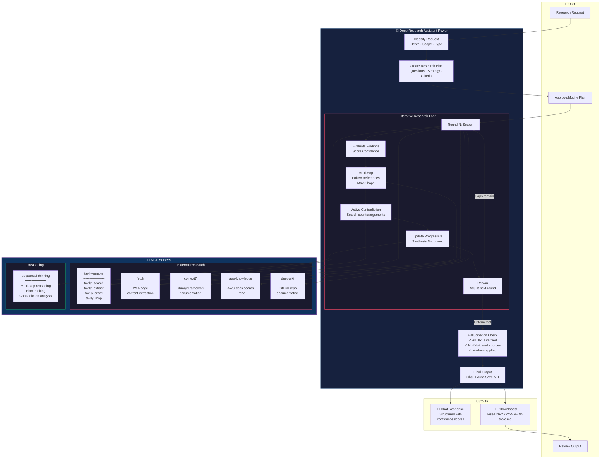
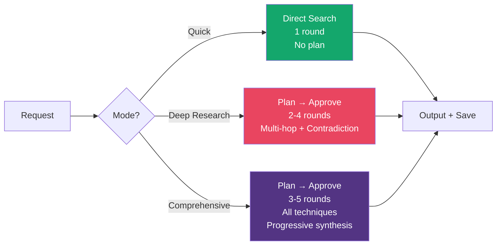
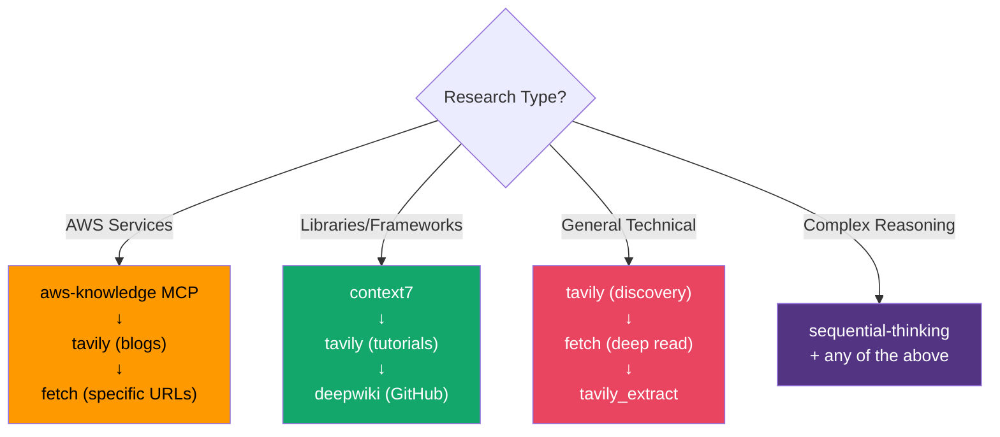
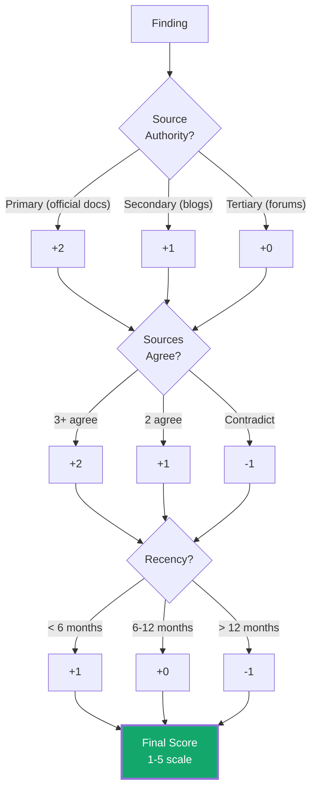

# Deep Research Power — Architecture Diagram

## System Overview

```mermaid
graph TB
    subgraph USER["👤 User"]
        REQ["Research Request"]
        APPROVE["Approve/Modify Plan"]
        REVIEW["Review Output"]
    end

    subgraph POWER["🧠 Deep Research Assistant Power"]
        CLASSIFY["Classify Request<br/>Depth · Scope · Type"]
        PLAN["Create Research Plan<br/>Questions · Strategy · Criteria"]
        
        subgraph LOOP["🔄 Iterative Research Loop"]
            SEARCH["Round N: Search"]
            EVALUATE["Evaluate Findings<br/>Score Confidence"]
            MULTIHOP["Multi-Hop<br/>Follow References<br/>Max 3 hops"]
            CONTRADICT["Active Contradiction<br/>Search counterarguments"]
            SYNTHESIS["Update Progressive<br/>Synthesis Document"]
            REPLAN["Replan<br/>Adjust next round"]
        end

        HALLCHECK["Hallucination Check<br/>✓ All URLs verified<br/>✓ No fabricated sources<br/>✓ Markers applied"]
        OUTPUT["Final Output<br/>Chat + Auto-Save MD"]
    end

    subgraph MCPS["🔌 MCP Servers"]
        subgraph EXTERNAL["External Research"]
            TAVILY["tavily-remote<br/>━━━━━━━━━━<br/>tavily_search<br/>tavily_extract<br/>tavily_crawl<br/>tavily_map"]
            FETCH["fetch<br/>━━━━━━━━━━<br/>Web page<br/>content extraction"]
            CONTEXT7["context7<br/>━━━━━━━━━━<br/>Library/Framework<br/>documentation"]
            AWSDOCS["aws-knowledge<br/>━━━━━━━━━━<br/>AWS docs search<br/>+ read"]
            DEEPWIKI["deepwiki<br/>━━━━━━━━━━<br/>GitHub repo<br/>documentation"]
        end

        subgraph REASONING["Reasoning"]
            SEQTHINK["sequential-thinking<br/>━━━━━━━━━━<br/>Multi-step reasoning<br/>Plan tracking<br/>Contradiction analysis"]
        end
    end

    subgraph OUTPUTS["📄 Outputs"]
        CHAT["💬 Chat Response<br/>Structured with<br/>confidence scores"]
        FILE["📁 ~/Downloads/<br/>research-YYYY-MM-DD-<br/>topic.md"]
    end

    REQ --> CLASSIFY
    CLASSIFY --> PLAN
    PLAN --> APPROVE
    APPROVE --> SEARCH

    SEARCH --> TAVILY
    SEARCH --> FETCH
    SEARCH --> CONTEXT7
    SEARCH --> AWSDOCS
    SEARCH --> DEEPWIKI

    SEARCH --> EVALUATE
    EVALUATE --> MULTIHOP
    MULTIHOP --> FETCH
    MULTIHOP --> CONTRADICT
    CONTRADICT --> TAVILY
    CONTRADICT --> SYNTHESIS
    SYNTHESIS --> SEQTHINK
    SYNTHESIS --> REPLAN
    REPLAN -->|"Gaps remain"| SEARCH
    REPLAN -->|"Criteria met"| HALLCHECK

    HALLCHECK --> OUTPUT
    OUTPUT --> CHAT
    OUTPUT --> FILE
    FILE --> REVIEW

    style LOOP fill:#1a1a2e,stroke:#e94560,stroke-width:2px,color:#fff
    style POWER fill:#16213e,stroke:#0f3460,stroke-width:2px,color:#fff
    style MCPS fill:#0f3460,stroke:#533483,stroke-width:2px,color:#fff
    style EXTERNAL fill:#1a1a2e,stroke:#e94560,color:#fff
    style REASONING fill:#1a1a2e,stroke:#14a76c,color:#fff
```

## Research Modes Flow

```mermaid
flowchart LR
    REQ["Request"] --> MODE{Mode?}
    
    MODE -->|"Quick"| Q["Direct Search<br/>1 round<br/>No plan"]
    MODE -->|"Deep Research"| D["Plan → Approve<br/>2-4 rounds<br/>Multi-hop + Contradiction"]
    MODE -->|"Comprehensive"| C["Plan → Approve<br/>3-5 rounds<br/>All techniques<br/>Progressive synthesis"]

    Q --> OUT["Output + Save"]
    D --> OUT
    C --> OUT

    style Q fill:#14a76c,color:#fff
    style D fill:#e94560,color:#fff
    style C fill:#533483,color:#fff
```

## Tool Selection by Research Type

```mermaid
flowchart TD
    TYPE{Research Type?}
    
    TYPE -->|"AWS Services"| AWS["aws-knowledge MCP<br/>↓<br/>tavily (blogs)<br/>↓<br/>fetch (specific URLs)"]
    TYPE -->|"Libraries/Frameworks"| LIB["context7<br/>↓<br/>tavily (tutorials)<br/>↓<br/>deepwiki (GitHub)"]
    TYPE -->|"General Technical"| GEN["tavily (discovery)<br/>↓<br/>fetch (deep read)<br/>↓<br/>tavily_extract"]
    TYPE -->|"Complex Reasoning"| THINK["sequential-thinking<br/>+ any of the above"]

    style AWS fill:#ff9900,color:#000
    style LIB fill:#14a76c,color:#fff
    style GEN fill:#e94560,color:#fff
    style THINK fill:#533483,color:#fff
```

## Confidence Scoring Flow

```mermaid
flowchart TD
    FIND["Finding"] --> AUTH{"Source<br/>Authority?"}
    AUTH -->|"Primary (official docs)"| A2["+2"]
    AUTH -->|"Secondary (blogs)"| A1["+1"]
    AUTH -->|"Tertiary (forums)"| A0["+0"]

    A2 --> CONC{"Sources<br/>Agree?"}
    A1 --> CONC
    A0 --> CONC

    CONC -->|"3+ agree"| C2["+2"]
    CONC -->|"2 agree"| C1["+1"]
    CONC -->|"Contradict"| CM1["-1"]

    C2 --> REC{"Recency?"}
    C1 --> REC
    CM1 --> REC

    REC -->|"< 6 months"| R1["+1"]
    REC -->|"6-12 months"| R0["+0"]
    REC -->|"> 12 months"| RM1["-1"]

    R1 --> SCORE["Final Score<br/>1-5 scale"]
    R0 --> SCORE
    RM1 --> SCORE

    style SCORE fill:#14a76c,color:#fff,stroke-width:3px
```
