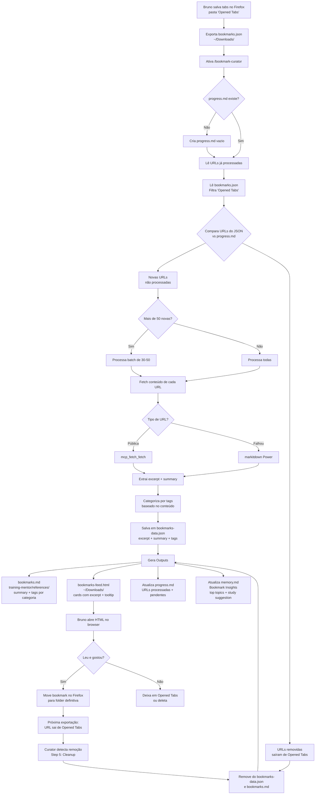
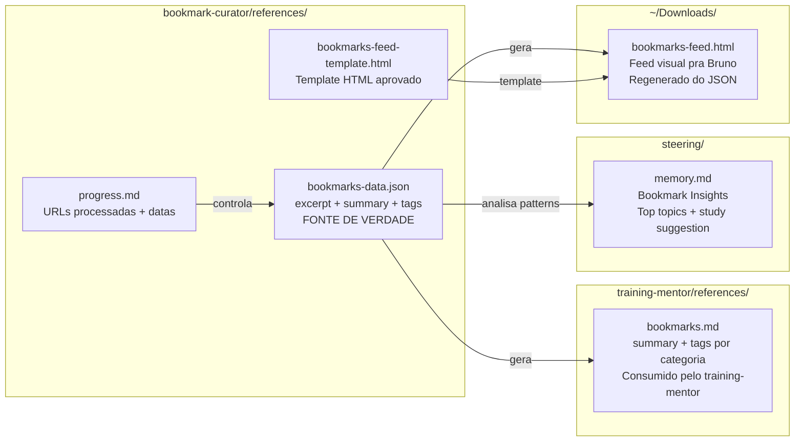
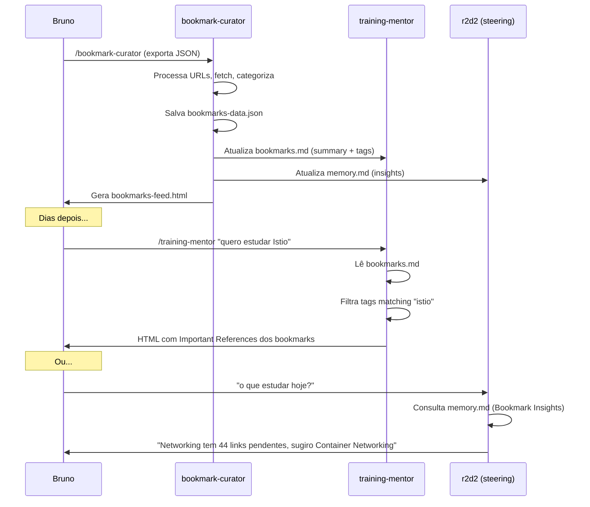

# Bookmark Curator - Flow Diagram

## Full Workflow

```mermaid
flowchart TD
    A[Bruno salva tabs no Firefox<br>pasta 'Opened Tabs'] --> B[Exporta bookmarks.json<br>~/Downloads/]
    B --> C[Ativa /bookmark-curator]
    
    C --> D{progress.md existe?}
    D -->|Não| E[Cria progress.md vazio]
    D -->|Sim| F[Lê URLs já processadas]
    E --> F
    
    F --> G[Lê bookmarks.json<br>Filtra 'Opened Tabs']
    G --> H{Compara URLs do JSON<br>vs progress.md}
    
    H --> I[Novas URLs<br>não processadas]
    H --> J[URLs removidas<br>saíram de Opened Tabs]
    
    I --> K{Mais de 50 novas?}
    K -->|Sim| L[Processa batch de 30-50]
    K -->|Não| M[Processa todas]
    
    L --> N[Fetch conteúdo de cada URL]
    M --> N
    
    N --> O{Tipo de URL?}
    O -->|Pública| P[mcp_fetch_fetch]
    O -->|Falhou| Q[markitdown Power]
    P --> S[Extrai excerpt + summary]
    Q --> S
    
    S --> T[Categoriza por tags<br>baseado no conteúdo]
    
    T --> U[Salva em bookmarks-data.json<br>excerpt + summary + tags]
    
    J --> V[Remove do bookmarks-data.json<br>e bookmarks.md]
    
    U --> W[Gera Outputs]
    V --> W
    
    W --> X[bookmarks.md<br>training-mentor/references/<br>summary + tags por categoria]
    W --> Y[bookmarks-feed.html<br>~/Downloads/<br>cards com excerpt + tooltip]
    W --> Z[Atualiza progress.md<br>URLs processadas + pendentes]
    W --> AA[Atualiza memory.md<br>Bookmark Insights<br>top topics + study suggestion]
    
    Y --> AB[Bruno abre HTML no browser]
    AB --> AC{Leu e gostou?}
    AC -->|Sim| AD[Move bookmark no Firefox<br>para folder definitiva]
    AC -->|Não| AE[Deixa em Opened Tabs<br>ou deleta]
    
    AD --> AF[Próxima exportação:<br>URL sai de Opened Tabs]
    AF --> AG[Curator detecta remoção<br>Step 5: Cleanup]
    AG --> V
```

## Data Architecture

```mermaid
flowchart LR
    subgraph "bookmark-curator/references/"
        JSON[bookmarks-data.json<br>excerpt + summary + tags<br>FONTE DE VERDADE]
        PROG[progress.md<br>URLs processadas + datas]
        TPL[bookmarks-feed-template.html<br>Template HTML aprovado]
    end
    
    subgraph "training-mentor/references/"
        MD[bookmarks.md<br>summary + tags por categoria<br>Consumido pelo training-mentor]
    end
    
    subgraph "steering/"
        MEM[memory.md<br>Bookmark Insights<br>Top topics + study suggestion]
    end
    
    subgraph "~/Downloads/"
        HTML[bookmarks-feed.html<br>Feed visual pra Bruno<br>Regenerado do JSON]
    end
    
    JSON -->|gera| MD
    JSON -->|gera| HTML
    TPL -->|template| HTML
    JSON -->|analisa patterns| MEM
    PROG -->|controla| JSON
```

## Integration with training-mentor

```mermaid
sequenceDiagram
    participant B as Bruno
    participant BC as bookmark-curator
    participant TM as training-mentor
    participant R2 as r2d2 (steering)
    
    B->>BC: /bookmark-curator (exporta JSON)
    BC->>BC: Processa URLs, fetch, categoriza
    BC->>BC: Salva bookmarks-data.json
    BC->>TM: Atualiza bookmarks.md (summary + tags)
    BC->>R2: Atualiza memory.md (insights)
    BC->>B: Gera bookmarks-feed.html
    
    Note over B: Dias depois...
    
    B->>TM: /training-mentor "quero estudar Istio"
    TM->>TM: Lê bookmarks.md
    TM->>TM: Filtra tags matching "istio"
    TM->>B: HTML com Important References dos bookmarks
    
    Note over B: Ou...
    
    B->>R2: "o que estudar hoje?"
    R2->>R2: Consulta memory.md (Bookmark Insights)
    R2->>B: "Networking tem 44 links pendentes, sugiro Container Networking"
```
