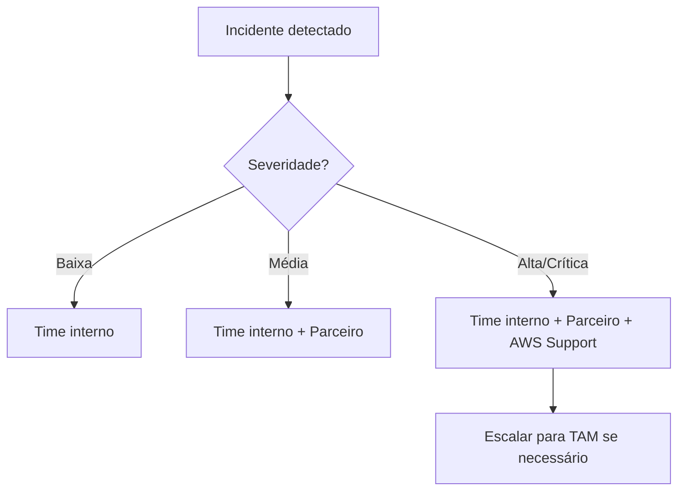

# Contatos de Apoio

> Contatos-chave para suporte e escalação.

## Equipe interna

| Nome | Papel | Área | E-mail | Telefone | Horário |
|------|-------|------|--------|----------|---------|
| <!-- TODO --> | | | | | |

## Suporte AWS

| Canal | Tipo | Nível | Como acionar |
|-------|------|-------|-------------|
| AWS Support | Enterprise | <!-- TODO: Basic/Developer/Business/Enterprise --> | <!-- TODO --> |
| TAM | Technical Account Manager | | <!-- TODO --> |
| SA | Solutions Architect | | <!-- TODO --> |

## Escalação

## Canais de comunicação

| Canal | Ferramenta | Finalidade | Participantes |
|-------|-----------|-----------|---------------|
| <!-- TODO --> | | | |
