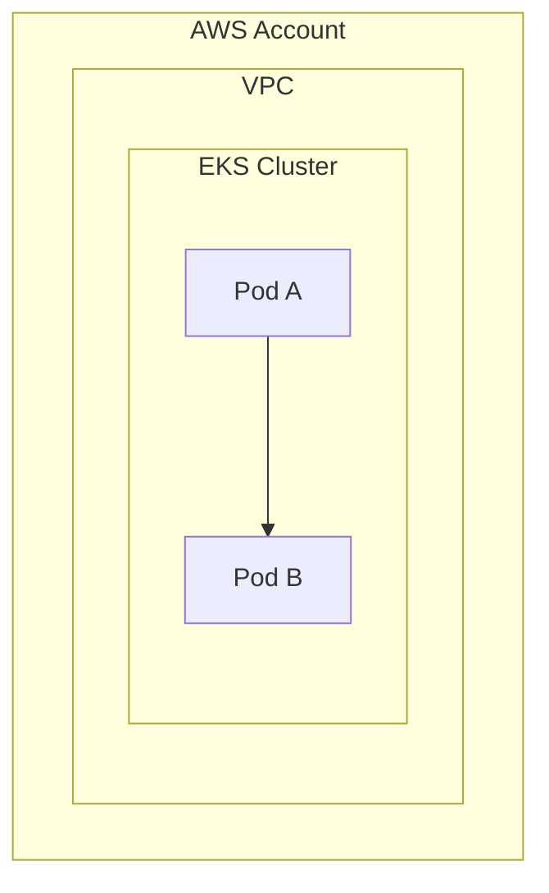
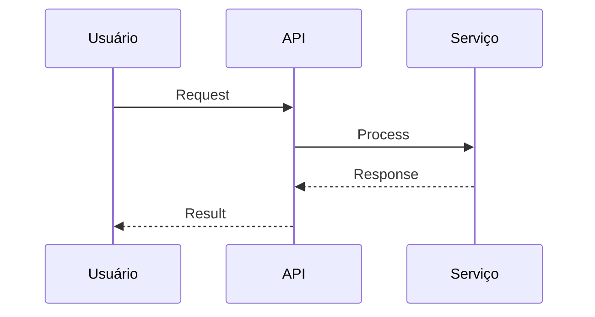

# Solution Template — Standard Subsections

> This template defines the standard structure for each solution's documentation file.
> Every solution (e.g., "Novo Ambiente PIX", "Circuit Breaker", "Monitoramento") follows this exact structure.
> Sections marked with 🤖 can be auto-populated from infrastructure code. Sections marked with 👤 require manual input.

---

## {Solution Name}

### O que é
👤 Descrição concisa da solução em 2-3 frases. O que ela faz no contexto do projeto.

### Objetivo
👤 Qual o objetivo de negócio que esta solução atende. Por que ela existe.

### Problema que resolve
👤 Qual problema específico existia antes desta solução. Qual era o cenário anterior (as-is) e qual é o cenário desejado (to-be).

### Públicos e usuários
👤 Quem são os usuários e stakeholders desta solução.

| Perfil | Descrição | Tipo de acesso |
|--------|-----------|----------------|
| | | |

### Regras de Negócio
👤 Regras de negócio que governam o comportamento da solução.

- RN01: [descrição]
- RN02: [descrição]

### Sistemas e ferramentas
🤖 Parcialmente inferível de Terraform providers e K8s resources.

| Sistema/Ferramenta | Finalidade | Versão |
|--------------------|-----------|--------|
| | | |

### Arquitetura
🤖 Inferível de Terraform modules e K8s resources.

<!-- TODO: ajustar diagrama com base na arquitetura real -->

### Infraestrutura e Ambientes
🤖 Inferível de Terraform workspaces/tfvars e K8s namespaces.

| Ambiente | Conta AWS | Região | Cluster | Namespace |
|----------|-----------|--------|---------|-----------|
| Dev | | | | |
| Staging | | | | |
| Prod | | | | |

### Repositórios
🤖 Inferível de ArgoCD Applications e git remotes.

| Repositório | Finalidade | Branch principal |
|-------------|-----------|-----------------|
| | | |

### Banco de Dados
🤖 Inferível de Terraform RDS/DynamoDB resources ou K8s StatefulSets.

| Banco | Engine | Ambiente | Endpoint |
|-------|--------|----------|----------|
| | | | |

### Integrações e APIs
🤖 Parcialmente inferível de K8s Services, Ingress, API Gateway.

| Integração | Tipo | Endpoint | Autenticação |
|------------|------|----------|--------------|
| | | | |

### Autenticação e Segurança
🤖 Parcialmente inferível de IAM roles, IRSA, NetworkPolicies, SecurityGroups.

- **Autenticação:** <!-- TODO: descrever método -->
- **Autorização:** <!-- TODO: descrever modelo -->
- **Criptografia em trânsito:** <!-- TODO: TLS/mTLS -->
- **Criptografia em repouso:** <!-- TODO: KMS keys -->
- **Network Policies:** <!-- TODO: listar -->

### Observabilidade e Monitoramento
🤖 Inferível de CloudWatch, Prometheus, Grafana configs.

| Componente | Ferramenta | Dashboard/Alarme |
|------------|-----------|-----------------|
| Logs | | |
| Métricas | | |
| Traces | | |
| Alertas | | |

### Governança, Compliance e Auditoria
👤 Requisitos regulatórios e de compliance aplicáveis.

- **Regulamentações:** <!-- TODO: BACEN, LGPD, PCI-DSS, etc. -->
- **Controles de auditoria:** <!-- TODO: CloudTrail, Config Rules -->
- **Políticas de retenção:** <!-- TODO: logs, dados -->

### Papéis e responsabilidades (RACI)
👤 Matriz RACI para esta solução.

| Atividade | Responsável (R) | Aprovador (A) | Consultado (C) | Informado (I) |
|-----------|-----------------|---------------|-----------------|----------------|
| | | | | |

### Gestão de acessos
🤖 Parcialmente inferível de IAM policies e K8s RBAC.

| Perfil | Recurso | Nível de acesso | Método |
|--------|---------|-----------------|--------|
| | | | |

### Fluxos funcionais
👤 Fluxos principais da solução.

<!-- TODO: ajustar com fluxos reais -->

### Testes e Validações Técnicas
👤 Estratégia de testes e validações.

| Tipo de teste | Ferramenta | Cobertura | Frequência |
|---------------|-----------|-----------|------------|
| | | | |

### Tratamento de Erros e Contingências
👤 Como a solução lida com falhas.

| Cenário de falha | Impacto | Ação de contingência | RTO | RPO |
|------------------|---------|---------------------|-----|-----|
| | | | | |

### Backup e Restauração
🤖 Parcialmente inferível de Terraform backup configs.

| Recurso | Estratégia | Frequência | Retenção | Procedimento de restore |
|---------|-----------|------------|----------|------------------------|
| | | | | |

### Referências e anexos

#### Documentação técnica (APIs e outros)
- <!-- TODO: links para docs de API, Swagger/OpenAPI specs -->

#### Diagramas
- <!-- TODO: links para diagramas de arquitetura, fluxo, rede -->

#### Repositórios
- <!-- TODO: links para repos relevantes -->
